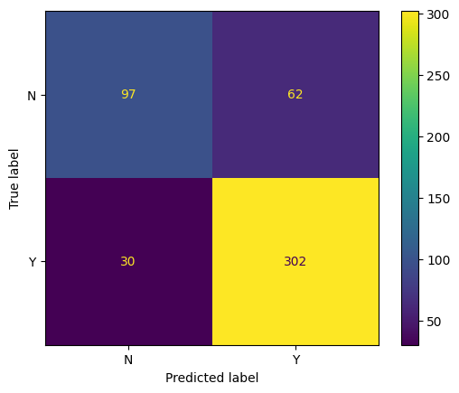
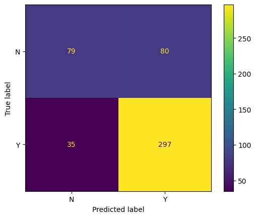

# Mini-project IV

### [Assignment](assignment.md)

## Project/Goals

The goals of this project were to:
* Create a model to determine whether a loan application would be approved based only on basic a few pieces of information.
* Implement a supervised learning pipeline to test various classification models.
* Deploy the best model (as determined from model evaluation metrics) to the cloud as an API that can interact with Postman and Python.

## Hypothesis

In terms of main (univariate) effects, I hypothesized that loan eligibility would be more probable under the following conditions:
* Higher education level 
* Higher applicant income, coapplicant, and total incomes.
* Longer amount term
* Credit history available

These hypotheses can be tested by comparing the distributions of these variables between approved and non-approved loan applications. This can be done visually using histograms and box plots. Statistically, we can use independent t-tests or one-way ANOVAs if the data are normally distributed.

I also hypothesized that self employment status would moderate the effect of income on loan approval, i.e. self employed individuals would need higher income for loan approval. Because of differences in the features and sample sizes of self employed and non-self employed applicants, this hypothesis could be tested by comparing the probability of loan eligibility between these two groups. Statistically, this would involve a Chi-squared test.

## EDA 

Statistical tests were not performed as this was not the scope of the project. Based on visual inspection of the data using graphs, the following characteristics were associated with higher loan approval:
* Property area being semiurban
* Married.
* Graduate (education).
* Available credit history. This was the univariate effect was most notable: Whereas loan applications were more likely to be approved overall, applicants without credit history were more likely to be denied.

The following features did not appear to differ between applicants with approved and non-approved loan applications:
* Applicant income.
* Total income (applicant plus coapplicant).
* Self employed status. Overall, self employed applicants had higher incomes.

Correlations:
* Total income was primarily determined by applicant income (0.89 correlation); coapplicant income only correlated with total income by 0.34. Many applications had low to zero coapplicant income.
* Higher applicant income was associated with a higher loan amount.

Ratio data were not normally distributed; they were skewed to the right.

# Process

The work for this project was performed in the `instructions.ipynb` notebook. Some custom functions are in saved in the `src` folder.

## Data exploration
Using histograms, box plots, and bar charts, I examined the differences between approved applications and non-approved applications in regards to the various features of interest.
<br><br>

## Iteration 1
### Data cleaning and feature engineering

* Total_Income was calculated as the sum of ApplicantIncome and CoapplicantIncome. These raw features were then excluded from modelling.
* LoanAmount and Total_Income were transformed using a log transformation, making their distributions less skewed.
* Missing values were filled using the SimpleImputer:
    * LoanAmount filled with group mean
    * Credit history filled with zero (assume no credit history if value is missing)
    * Self_Employed, Gender, Dependents, and Married features were filled with the most frequent value in the data set.
* Numerical features were normalized using StandardScaler.
* Categorical features were one-hot encoded.

These steps were put into a pipeline that lead to the selected estimator. 
<br><br>

### Modelling

The first estimator selected was logistic regression using default hyperparameters. Once I confirmed that these steps were able to provide model predictions, I used GridSearchCV for basic hyperparameter tuning using LogisticRegression and RandomForestClassifier estimators. An 80-20 train-test split was used. Model performance was evaluated using accuracy, precision, recall, F1 score, and confusion matrix. Metrics for the train data set and test data set were compared to evaluate for overfitting.
<br><br>

### Model deployment
The best RandomForestClassifier model found from the grid search was selected for deployment, first to the local machine, then to an AWS instance. API requests were tested using Python and Postman.
<br><br>
## Iteration 2
Instead of using the mean or most frequent value of the entire group to fill missing values, I wanted to use the mean/most frequent value for subgroups. Using a custom class (`GroupMeanImputer`) from lecture material, I filled the missing LoanAmount values based on the mean grouped by Education. While this appeared to work in the pipeline up to the modelling step, it resulted in a `FitFailedWarning` when the pipeline was used in GridSearchCV and RandomizedSearchCV. A mentor (Toby Chang) helped identify that the source of the warning was due to `GroupMeanImputer` custom class, but didn't know the precise issue and said that debugging it would require testing one of the functions within the `.transform` method of that class. I did not proceed to resolve this error.
<br><br>

## Iteration 3
Due to the warnings associated with iteration 2, I returned to the same pipeline from iteration 1 and simply repeated GridSearchCV with additional hyperparameters to see which model would perform best.  
<br><br>

# Results
## Random Forest Classifier
Best random forest classifier parameters from randomized search: `{'classifier__class_weight': 'balanced', 'classifier__max_depth': 5, 'classifier__n_estimators': 200}`


Metric | Test data	| Training data		| Difference
--- | --- | --- | ---
Accuracy: 	| 78.05%		| 81.26%		| -3.21%
Recall: 	| 48.48%		| 61.01%		| -12.52%
Precision: 	| 61.54%		| 76.38%		| -14.84%
F1: 		| 54.24%		| 67.83%		| -13.59%


## Logistic Regression Classifier
Best logistic classifier parameters from grid search: `{'classifier__C': 0.008, 'classifier__class_weight': 'balanced', 'classifier__solver': 'liblinear'}`

Metric | Test data| Training data		| Difference
--- | --- | --- | ---
Accuracy: 	| 78.86%		| 76.58%		| 2.28%
Recall: 	| 48.48%		| 49.69%		| -1.20%
Precision: 	| 64.00%		| 69.30%		| -5.30%
F1: 		| 55.17%		| 57.88%		| -2.70%


## Overall
Based on the above evaluation metrics, I infer that:
* The random forest models were more accurate for the training data but were more likely to overfit the training data than the logistical regression models based on differences in evaluation metrics on the test data vs. training data (particularly for recall, precision, F1, but also for accuracy).
* For logistic regression, tuning of the hyperparameters C, class weight, and solver did not impact model performance.

As a result, I chose the hyperparameter-tuned logistic regression model. Interestingly, hyperparameter tuning in Iteration 3 did not change any of the evaluation metrics for the logistic regression classifier compared with Iteration 1, though it did slightly improve metrics for the random forest classifier.

# Demo
The API endpoint URL is `http://ec2-34-229-145-28.compute-1.amazonaws.com:6000/predict` 

This is an example row of the data set in JSON format that can be entered into the body Postman app to make the POST request to the API: 
```
{"Gender": "Male",
 "Married": "Yes",
 "Dependents": "0",
 "Education": "Graduate",
 "Self_Employed": "No",
 "ApplicantIncome": 2083,
 "CoapplicantIncome": 3150.0,
 "LoanAmount": 128.0,
 "Loan_Amount_Term": 360.0,
 "Credit_History": 1.0,
 "Property_Area": "Semiurban"}
```

Here's the code to make access the prediction API using Python:
```python
import requests
import pandas as pd

# load data set from which to obtain a row to make the API call
df = pd.read_csv('data.csv')
X = df.drop(columns='Loan_Status')
row = [4] # Pick a random row number that does not contain any null values
json_data = X.iloc[row,:].to_dict()

URL = "http://ec2-34-229-145-28.compute-1.amazonaws.com:6000/predict"

# API request
r = requests.post(url = URL, json = json_data) 
r.json()
```
## Challenges 
While using `Pipeline` for modelling requires fewer lines of code, it makes it harder to identify and troubleshoot errors. Certain transformation classes from Sklearn converted DataFrames into arrays and removed column names in the process, which meant any steps relying on column names or Pandas datatypes could not be easily implemented afterwards. For this reason, the log transformations were performed at the start of the pipeline before missing values were imputed. 

As discussed in the Process section, I was not able to fill missing values with as much specificity as I would have liked.

Given the challenges encountered, in the future, I would:
* Fit and transform one pipeline step at a time if using Pipeline, rather than create the whole Pipeline and testing it at the end.
* Create the most basic minimal viable product Pipeline, then re-run the Pipeline after each single change. This would allow for easier troubleshooting.

## Future Goals
With more time, I would:
* Include coapplicant income as a separate feature, since it did not correlate highly with any other feature in the model.
* Create a custom function to fill missing values based on the average for a specified group. For example, fill missing LoanAmount based on the average for a given Education and Employment group.
* Evaluate feature importance to inform feature selection.
* Test additional estimators, such as XGBoost.
* Test additional hyperparameters.